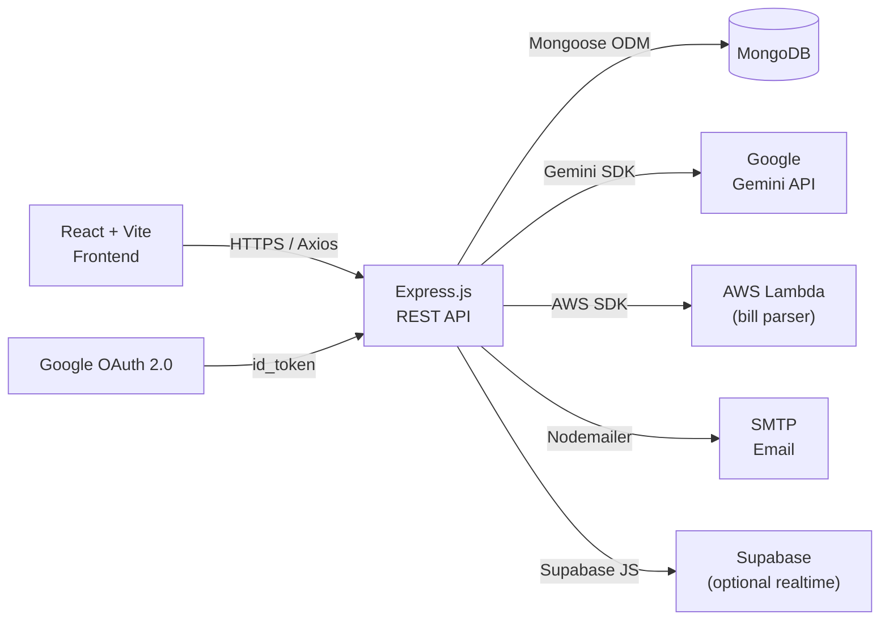
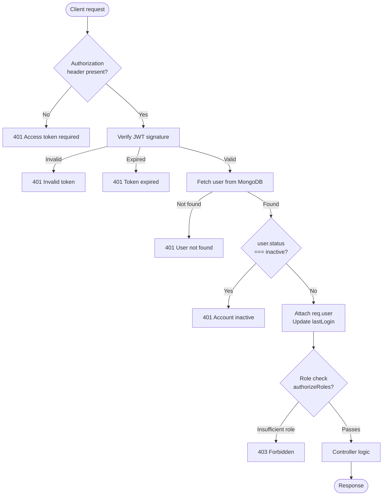
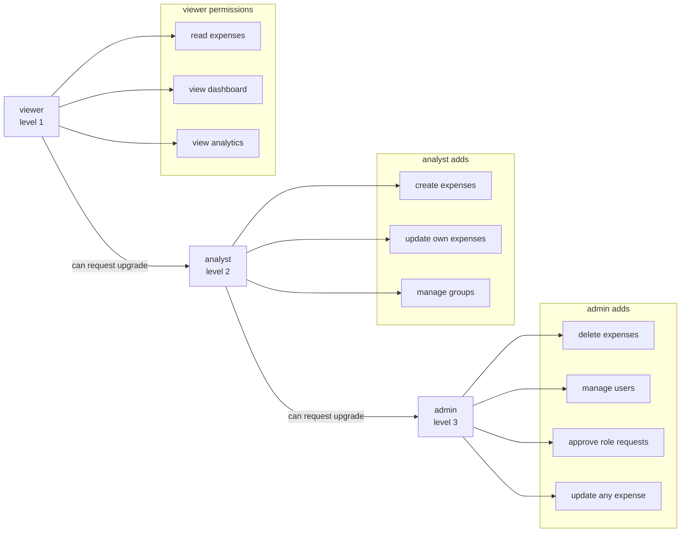
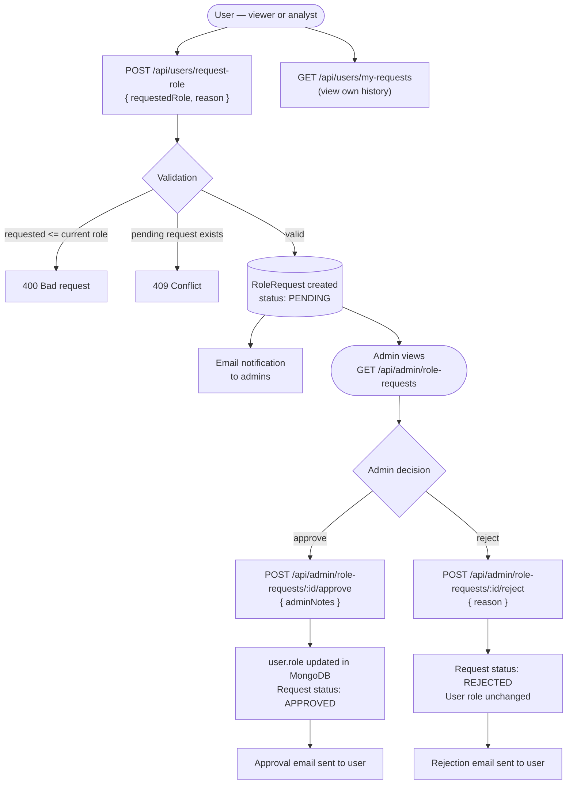
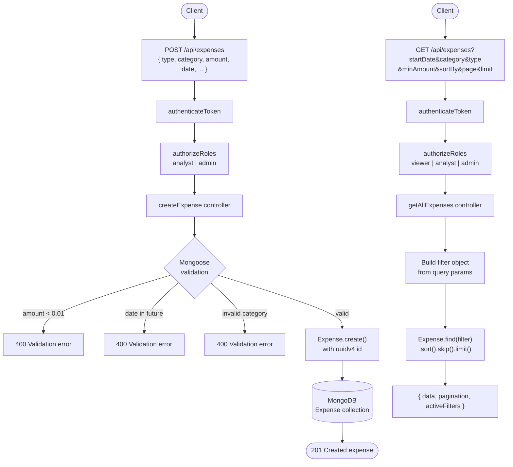
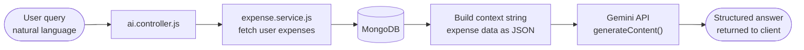

<p align="center">
  
  
  
  
  
  
  
</p>

<h1 align="center">FinanceGuard AI</h1>

<p align="center">
  <strong>An intelligent personal finance tracker powered by Google Gemini AI — with role-based access control, shared expense management, AI-generated insights, bill parsing, and a full analytics dashboard.</strong>
</p>

---

## Table of contents

1. [Overview](#1-overview)
2. [Tech stack](#2-tech-stack)
3. [Feature map](#3-feature-map)
4. [Architecture](#4-architecture)
   - [System overview](#41-system-overview)
   - [Request lifecycle](#42-request-lifecycle)
   - [RBAC role hierarchy](#43-rbac-role-hierarchy)
   - [Role request workflow](#44-role-request-workflow)
   - [Expense data flow](#45-expense-data-flow)
5. [Project structure](#5-project-structure)
6. [Getting started](#6-getting-started)
   - [Prerequisites](#61-prerequisites)
   - [Clone and install](#62-clone-and-install)
   - [Environment variables — backend](#63-environment-variables--backend)
   - [Environment variables — frontend](#64-environment-variables--frontend)
   - [Run in development](#65-run-in-development)
   - [Run in production](#66-run-in-production)
7. [API reference](#7-api-reference)
   - [Authentication](#71-authentication)
   - [Expenses](#72-expenses)
   - [Dashboard & analytics](#73-dashboard--analytics)
   - [Users & RBAC](#74-users--rbac)
   - [Groups & shared expenses](#75-groups--shared-expenses)
   - [AI endpoints](#76-ai-endpoints)
   - [Bills](#77-bills)
   - [Grants](#78-grants)
8. [Role-based access control](#8-role-based-access-control)
9. [AI features](#9-ai-features)
10. [Data models](#10-data-models)
11. [Frontend pages & components](#11-frontend-pages--components)
12. [Deployment](#12-deployment)
13. [Troubleshooting](#13-troubleshooting)
14. [Contributing](#14-contributing)
15. [License](#15-license)

---

## 1. Overview

FinanceGuard AI is a full-stack personal finance management application that goes beyond simple expense logging. It combines real-time analytics, AI-driven insights via Google Gemini, bill image parsing via AWS Lambda, and a full collaborative shared-expense system — all protected by a three-tier role-based access control layer.

**Why it exists:** Most personal finance tools are either too simple (spreadsheets) or too opaque (black-box apps). FinanceGuard AI gives users both the raw data control of a developer tool and the intelligence of an AI assistant, while giving teams or households a structured way to split and track shared costs.

**Key differentiators:**
- Natural-language AI queries over your own expense data (powered by Gemini)
- Structured RBAC with an admin-controlled role-upgrade request flow
- Bill image → structured expense parsing (AWS Lambda + OCR)
- Group-based shared expense splitting with invitation emails
- Grant management sub-module (faculty/student grant tracking)

---

## 2. Tech stack

| Layer | Technology | Purpose |
|---|---|---|
| Frontend framework | React 18 + Vite 5 | SPA with fast HMR |
| Styling | Tailwind CSS + shadcn/ui | Utility-first design system |
| State management | React Context + hooks | Auth state, user role, UI state |
| HTTP client | Axios | API calls with interceptors |
| Charts | Recharts | Monthly trends, category breakdown |
| Backend framework | Express.js (ESM) | REST API server |
| Database | MongoDB + Mongoose 9 | Document storage with schemas |
| Authentication | Google OAuth 2.0 + JWT | Stateless auth via access/refresh tokens |
| Refresh tokens | MongoDB `RefreshToken` model | Secure token rotation |
| AI engine | Google Gemini API (`@google/generative-ai`) | Natural language finance queries |
| File parsing | AWS Lambda (`@aws-sdk/client-lambda`) | Bill image → structured data |
| Cloud storage | AWS S3 (via Lambda) | Bill image uploads |
| Email | Nodemailer | Invitation + notification emails |
| Group backend | Supabase (optional) | Realtime group features |
| ID generation | `uuid` v9 | All entity IDs |
| Auth tokens | `jsonwebtoken` | JWT signing/verification |

---

## 3. Feature map

```
FinanceGuard AI
│
├── Authentication
│   ├── Google OAuth 2.0 login
│   ├── JWT access tokens (15m) + refresh tokens (7d)
│   └── Token rotation on refresh
│
├── Expense management
│   ├── Create / read / update / delete expenses
│   ├── Types: income, expense
│   ├── 11 categories (Food, Transport, Bills, Salary, etc.)
│   ├── Tags, notes, recurring with frequency + end date
│   ├── Advanced filtering (date range, category, type, amount range, tags)
│   ├── Sorting (date, amount, category, createdAt)
│   └── Pagination on all list endpoints
│
├── Dashboard & analytics
│   ├── Summary cards (totalIncome, totalExpenses, netBalance)
│   ├── Category breakdown with % of total
│   ├── Monthly trends (income vs expenses vs net, 12 months)
│   ├── Top spending categories
│   ├── Daily spending insights (avg / max / min)
│   └── Recent activity feed
│
├── AI features (Google Gemini)
│   ├── Natural language expense queries
│   ├── Spending pattern analysis
│   ├── Budget recommendations
│   └── Anomaly / fraud detection hints
│
├── Bill parsing
│   ├── Upload bill image
│   ├── AWS Lambda OCR extraction
│   └── Auto-populate expense form from parsed data
│
├── Role-based access control (RBAC)
│   ├── Roles: viewer → analyst → admin
│   ├── Per-role permission matrix
│   ├── Role upgrade request workflow
│   └── Admin approval / rejection with notes
│
├── Groups & shared expenses
│   ├── Create / manage groups
│   ├── Invite members via email
│   ├── Log shared expenses with split tracking
│   └── View group expense history
│
├── Grants
│   ├── Faculty grant creation
│   ├── Student grant application
│   └── Award / receive tracking flags on user
│
└── User management
    ├── View own profile + permissions
    ├── Update name / profile picture
    ├── Admin: list all users with filters
    ├── Admin: change role / activate / deactivate
    └── My role-request history
```

---

## 4. Architecture

### 4.1 System overview



### 4.2 Request lifecycle

Every authenticated API call passes through this pipeline before reaching a controller:



### 4.3 RBAC role hierarchy



### 4.4 Role request workflow



### 4.5 Expense data flow



---

## 5. Project structure

```
ai-finance-tracker/
│
├── frontend/                         # React + Vite SPA
│   ├── public/
│   ├── src/
│   │   ├── components/
│   │   │   ├── ui/                   # shadcn/ui primitives
│   │   │   ├── Dashboard.jsx         # Main dashboard view
│   │   │   ├── AddExpense.jsx        # Expense creation form
│   │   │   ├── BillUpload.jsx        # Receipt/bill upload interface
│   │   │   ├── AIChat.jsx            # AI chatbot interface
│   │   │   ├── MultiAgent.jsx        # Multi-agent AI interface
│   │   │   ├── RoleRequestModal.jsx  # Role upgrade request form
│   │   │   ├── MyRequestStatus.jsx   # Request status tracker
│   │   │   ├── LandingPage.jsx       # Public landing page
│   │   │   ├── Login.jsx             # Login with Google OAuth
│   │   │   ├── AuthCallback.jsx      # OAuth callback handler
│   │   │   ├── ProtectedRoute.jsx    # Route guard (auth + admin)
│   │   │   └── ...
│   │   ├── pages/
│   │   │   └── AdminRoleRequestsPage.jsx  # Admin role request management
│   │   ├── config/
│   │   │   └── api.config.js         # API base URL + endpoint definitions
│   │   ├── context/
│   │   │   └── AuthContext.jsx       # JWT + user state + role flags
│   │   ├── utils/
│   │   │   └── api.js               # Axios instance + interceptors
│   │   ├── hooks/
│   │   └── App.jsx
│   ├── .env
│   ├── vite.config.js
│   ├── vercel.json
│   └── package.json
│
└── backend/                          # Express.js REST API
    ├── config/
    │   ├── database.js               # Mongoose connect / close / isConnected
    │   ├── cors.js                   # CORS config from FRONTEND_URL
    │   ├── permissions.js            # Per-role permission matrix + helpers
    │   ├── gemini.js                 # Gemini API client init
    │   └── aws.js                    # AWS Lambda client
    │
    ├── models/
    │   ├── User.js                   # id, email, name, role, status, lastLogin
    │   ├── Expense.js                # type, category, amount, date, tags, recurring
    │   ├── Group.js                  # id, name, members[]
    │   ├── SharedExpense.js          # groupId, amount, splits
    │   ├── RefreshToken.js           # userId, token, expiresAt
    │   ├── BillUpload.js             # S3 key, parsed data, status
    │   └── Grant.js                  # grantee, grantor, amount, status
    │
    ├── middleware/
    │   ├── auth.middleware.js        # authenticateToken, optionalAuth
    │   ├── authorize.middleware.js   # authorizeRoles, requireMinimumRole,
    │   │                            #   checkPermission, adminOnly
    │   └── errorHandler.js          # Centralised error → HTTP response
    │
    ├── controllers/
    │   ├── auth.controller.js        # OAuth callback, refresh, logout
    │   ├── expense.controller.js     # CRUD + stats + monthly + category
    │   ├── dashboard.controller.js   # Summary, trends, categories, top-spend
    │   ├── user.controller.js        # Profile, admin user management
    │   ├── group.controller.js
    │   ├── sharedExpense.controller.js
    │   ├── ai.controller.js
    │   ├── bill.controller.js
    │   ├── grant.controller.js
    │   └── invitation.controller.js
    │
    ├── routes/
    │   ├── index.js                  # Mounts all route groups
    │   ├── auth.routes.js
    │   ├── expense.routes.js         # RBAC-gated expense routes
    │   ├── dashboard.routes.js       # /api/dashboard/*
    │   ├── user.routes.js            # /api/users/*
    │   ├── group.routes.js
    │   ├── sharedExpense.routes.js
    │   ├── ai.routes.js
    │   ├── bill.routes.js
    │   ├── grant.routes.js
    │   └── invitation.routes.js
    │
    ├── services/
    │   ├── analytics.service.js      # AnalyticsService (static methods)
    │   ├── auth.service.js
    │   ├── expense.service.js
    │   ├── ai.service.js
    │   ├── email.service.js
    │   ├── group.service.js
    │   ├── sharedExpense.service.js
    │   ├── billExtraction.service.js
    │   ├── fraudDetection.service.js
    │   ├── grant.service.js
    │   ├── invitation.service.js
    │   ├── supabase.service.js
    │   └── token.service.js
    │
    ├── utils/
    │   ├── jwt.js                    # signAccessToken, signRefreshToken, verify*
    │   ├── hashGenerator.js
    │   ├── billValidator.js
    │   ├── gstValidator.js
    │   └── sampleData.js
    │
    ├── scripts/
    │   └── migrate-user-fields.js    # One-time migration for RBAC fields
    │
    ├── server.js                     # Express app bootstrap
    ├── .env
    └── package.json
```

---

## 6. Getting started

### 6.1 Prerequisites

- Node.js >= 18.x
- npm >= 9.x
- MongoDB instance (local or MongoDB Atlas)
- Google Cloud project with OAuth 2.0 credentials and Gemini API key
- (Optional) AWS account with Lambda function for bill parsing
- (Optional) SMTP credentials for email (Nodemailer)

### 6.2 Clone and install

```bash
git clone https://github.com/your-username/ai-finance-tracker.git
cd ai-finance-tracker

# Install backend dependencies
cd backend
npm install

# Install frontend dependencies
cd ../frontend
npm install
```

### 6.3 Environment variables — backend

Create `backend/.env`:

```env
# Server
PORT=8000
NODE_ENV=development

# MongoDB
MONGO_URL=mongodb://localhost:27017
DB_NAME=finance_tracker

# JWT
JWT_SECRET=your-super-secret-jwt-key-min-32-chars
JWT_REFRESH_SECRET=your-refresh-secret-key-min-32-chars
ACCESS_TOKEN_EXPIRY=15m
REFRESH_TOKEN_EXPIRY=7d

# Google OAuth
GOOGLE_CLIENT_ID=your-google-client-id.apps.googleusercontent.com
GOOGLE_CLIENT_SECRET=your-google-client-secret
# BACKEND_URL is used to construct the OAuth callback: ${BACKEND_URL}/api/auth/google/callback
BACKEND_URL=http://localhost:8000

# Frontend URL (for CORS + post-OAuth redirect)
FRONTEND_URL=http://localhost:5173

# CORS (comma-separated list of allowed origins; localhost is always allowed)
CORS_ORIGINS=http://localhost:5173

# Gemini AI
GEMINI_API_KEY=your-gemini-api-key

# AWS (optional — for bill parsing)
AWS_REGION=us-east-1
AWS_ACCESS_KEY_ID=your-access-key
AWS_SECRET_ACCESS_KEY=your-secret-key
LAMBDA_FUNCTION_NAME=bill-extractor
USE_LAMBDA=false

# Email / SMTP (optional — notifications fall back to console.log if missing)
EMAIL_HOST=smtp.gmail.com
EMAIL_PORT=587
EMAIL_USER=your-email@gmail.com
EMAIL_PASSWORD=your-app-password
EMAIL_FROM=FinanceGuard AI <your-email@gmail.com>

# Supabase (optional)
SUPABASE_URL=https://your-project.supabase.co
SUPABASE_ANON_KEY=your-anon-key
```

### 6.4 Environment variables — frontend

Create `frontend/.env`:

```env
# Backend API base URL — points to the Express server (no /api suffix)
# The /api prefix is added automatically by frontend/src/config/api.config.js
VITE_BACKEND_URL=http://localhost:8000
```

> **API base URL configuration:** The frontend resolves the backend URL through
> `frontend/src/config/api.config.js`. It reads `VITE_BACKEND_URL` (recommended)
> or the legacy `VITE_API_BASE_URL` fallback. In production, if neither is set the
> app throws an error. In development it defaults to `http://localhost:8000`.

### 6.5 Run in development

```bash
# Terminal 1 — backend (auto-restarts on file changes via --watch)
cd backend
npm run dev

# Terminal 2 — frontend (Vite HMR)
cd frontend
npm run dev
```

Backend runs on `http://localhost:8000`  
Frontend runs on `http://localhost:5173`

### 6.6 Run in production

```bash
# Backend
cd backend
npm start

# Frontend — build static assets then serve via a CDN or static host
cd frontend
npm run build
# Deploy dist/ to Vercel / Netlify / S3
```

For Vercel (frontend), add `frontend/vercel.json`:

```json
{
  "rewrites": [{ "source": "/(.*)", "destination": "/index.html" }]
}
```

---

## 7. API reference

All routes are prefixed with `/api`. Protected routes require:
```
Authorization: Bearer <access_token>
```

### 7.1 Authentication

| Method | Path | Auth | Description |
|---|---|---|---|
| `GET` | `/auth/google` | No | Redirect to Google OAuth consent |
| `GET` | `/auth/google/callback` | No | OAuth callback — sets JWT, returns tokens |
| `POST` | `/auth/refresh` | No | Exchange refresh token for new access token |
| `POST` | `/auth/logout` | Yes | Revoke refresh token |

**Refresh token request:**
```json
{ "refreshToken": "eyJhbGciOiJIUzI1NiIsInR5cCI6IkpXVCJ9..." }
```

**Refresh token response:**
```json
{
  "accessToken": "eyJ...",
  "refreshToken": "eyJ..."
}
```

### 7.2 Expenses

| Method | Path | Roles | Description |
|---|---|---|---|
| `POST` | `/expenses` | analyst, admin | Create expense |
| `GET` | `/expenses` | viewer, analyst, admin | List with filters + pagination |
| `GET` | `/expenses/recent` | viewer, analyst, admin | Last N expenses |
| `GET` | `/expenses/stats` | viewer, analyst, admin | Income/expense totals |
| `GET` | `/expenses/monthly` | viewer, analyst, admin | Monthly aggregation |
| `GET` | `/expenses/category/:category` | viewer, analyst, admin | Expenses by category |
| `PUT` | `/expenses/:id` | analyst (own), admin (any) | Update expense |
| `DELETE` | `/expenses/:id` | admin | Delete expense |

**Create expense body:**
```json
{
  "type": "expense",
  "category": "Food",
  "amount": 450.00,
  "date": "2025-03-15",
  "description": "Team lunch",
  "tags": ["work", "lunch"],
  "isRecurring": false,
  "notes": "Claimed on expenses"
}
```

**GET /expenses query parameters:**

| Param | Type | Example |
|---|---|---|
| `startDate` | ISO date | `2025-01-01` |
| `endDate` | ISO date | `2025-03-31` |
| `category` | string | `Food` |
| `type` | string | `income` or `expense` |
| `minAmount` | number | `100` |
| `maxAmount` | number | `5000` |
| `tags` | string | `work` |
| `sortBy` | string | `date`, `amount`, `category` |
| `sortOrder` | string | `asc` or `desc` |
| `page` | number | `1` |
| `limit` | number | `20` |

**Paginated response shape:**
```json
{
  "data": [ /* expense objects */ ],
  "pagination": {
    "total": 145,
    "page": 2,
    "limit": 20,
    "pages": 8
  },
  "activeFilters": { "category": "Food", "sortBy": "date", "sortOrder": "desc" }
}
```

**Valid categories:** `Food`, `Transport`, `Shopping`, `Bills`, `Entertainment`, `Salary`, `Bonus`, `Investment`, `Healthcare`, `Education`, `Others`

### 7.3 Dashboard & analytics

| Method | Path | Roles | Description |
|---|---|---|---|
| `GET` | `/dashboard` | all | Full summary (all metrics in parallel) |
| `GET` | `/dashboard/categories` | all | Category breakdown with percentages |
| `GET` | `/dashboard/trends` | all | Monthly trends (`?months=12`) |
| `GET` | `/dashboard/top-categories` | all | Top spending categories (`?limit=5`) |

**GET /dashboard response:**
```json
{
  "summary": {
    "dateRange": { "start": "2025-01-01", "end": "2025-12-31" },
    "totals": {
      "totalIncome": 85000.00,
      "totalExpenses": 52340.50,
      "netBalance": 32659.50
    }
  },
  "categoryBreakdown": [
    { "category": "Food", "total": 12400.00, "count": 87, "percentage": 23.69 }
  ],
  "monthlyTrends": [
    { "month": "2025-01", "income": 42000.00, "expenses": 26170.25, "netBalance": 15829.75, "txCount": 34 }
  ],
  "topCategories": [ /* top 5 by spend */ ],
  "insights": {
    "avgDaily": 1744.68,
    "maxDaily": 8200.00,
    "minDaily": 120.00
  },
  "recentActivity": [ /* last 10 expenses */ ]
}
```

### 7.4 Users & RBAC

| Method | Path | Roles | Description |
|---|---|---|---|
| `GET` | `/users/me` | all | Current user + permissions |
| `GET` | `/users` | admin | List all users (`?role=&status=&page=&limit=`) |
| `GET` | `/users/:userId` | admin or self | Get user by ID |
| `PUT` | `/users/:userId/role` | admin | Change user role |
| `PUT` | `/users/:userId/status` | admin | Activate / deactivate user |
| `PUT` | `/users/:userId/profile` | admin or self | Update name / profilePic |
| `POST` | `/users/request-role` | all | Submit role upgrade request |
| `GET` | `/users/my-requests` | all | Own request history |
| `GET` | `/admin/role-requests` | admin | All pending requests |
| `POST` | `/admin/role-requests/:id/approve` | admin | Approve with notes |
| `POST` | `/admin/role-requests/:id/reject` | admin | Reject with reason |

**GET /users/me response:**
```json
{
  "user": {
    "id": "uuid-here",
    "email": "user@example.com",
    "name": "Kalra",
    "role": "analyst",
    "status": "active",
    "lastLogin": "2025-04-05T10:30:00.000Z"
  },
  "permissions": {
    "canViewRecords": true,
    "canCreateRecords": true,
    "canUpdateRecords": true,
    "canDeleteRecords": false,
    "canViewAnalytics": true,
    "canViewDashboard": true,
    "canManageUsers": false,
    "canManageGroups": true
  }
}
```

**Role request body:**
```json
{
  "requestedRole": "analyst",
  "reason": "I need to log team expenses for the Q2 project budget."
}
```

### 7.5 Groups & shared expenses

| Method | Path | Auth | Description |
|---|---|---|---|
| `POST` | `/groups` | Yes | Create group |
| `GET` | `/groups` | Yes | My groups |
| `GET` | `/groups/:id` | Yes | Group details + members |
| `DELETE` | `/groups/:id` | Yes | Delete group |
| `POST` | `/shared-expenses` | Yes | Log shared expense |
| `GET` | `/shared-expenses` | Yes | Group shared expenses |
| `POST` | `/invitations` | Yes | Invite member by email |
| `GET` | `/invitations/accept/:token` | No | Accept invitation via link |

### 7.6 AI endpoints

| Method | Path | Auth | Description |
|---|---|---|---|
| `POST` | `/ai/chat` | Yes | Natural language expense query (chat interface) |
| `POST` | `/ai/multi-agent` | Yes | Multi-agent spending pattern analysis |
| `GET` | `/ai/behavioral-insight` | Yes | Behavioral finance insights |

**AI chat body:**
```json
{
  "query": "How much did I spend on food last month compared to this month?"
}
```

**AI chat response:**
```json
{
  "answer": "You spent ₹12,400 on food last month vs ₹9,800 this month — a 21% decrease.",
  "data": { /* supporting expense data used for context */ }
}
```

### 7.7 Bills

| Method | Path | Auth | Description |
|---|---|---|---|
| `POST` | `/bills/upload` | Yes | Upload bill image (multipart/form-data) |
| `GET` | `/bills` | Yes | My parsed bills |
| `GET` | `/bills/:id` | Yes | Bill details + parsed fields |

Upload uses `multer` → invokes AWS Lambda OCR → stores structured result.

### 7.8 Grants

| Method | Path | Auth | Description |
|---|---|---|---|
| `POST` | `/grants` | Yes (faculty) | Create grant |
| `GET` | `/grants` | Yes | My grants |
| `PUT` | `/grants/:id/award` | Yes | Award grant to student |
| `GET` | `/grants/received` | Yes (student) | Grants received |

---

## 8. Role-based access control

### Permission matrix

| Permission | viewer | analyst | admin |
|---|:---:|:---:|:---:|
| `canViewRecords` | ✅ | ✅ | ✅ |
| `canCreateRecords` | ❌ | ✅ | ✅ |
| `canUpdateRecords` | ❌ | ✅ (own) | ✅ (any) |
| `canDeleteRecords` | ❌ | ❌ | ✅ |
| `canViewAnalytics` | ✅ | ✅ | ✅ |
| `canViewDashboard` | ✅ | ✅ | ✅ |
| `canManageUsers` | ❌ | ❌ | ✅ |
| `canManageGroups` | ❌ | ✅ | ✅ |

### Middleware chain

Three composable middleware functions are available in `middleware/authorize.middleware.js`:

```js
// Allow exactly these roles
authorizeRoles('viewer', 'analyst', 'admin')

// Allow anyone at or above this role level
requireMinimumRole('analyst')

// Allow only if this permission flag is true for the user's role
checkPermission('canDeleteRecords')

// Shorthand for adminOnly
adminOnly  // === authorizeRoles('admin')
```

All 403 responses include `userRole` and context so the frontend can react appropriately:

```json
{
  "error": "Forbidden",
  "message": "This action requires one of: [admin]. Your role: analyst",
  "userRole": "analyst"
}
```

### Error handler

All errors are normalised in `middleware/errorHandler.js`:

| Error type | HTTP status | Response |
|---|---|---|
| Mongoose `ValidationError` | 400 | `{ error, fields: [{ field, message }] }` |
| MongoDB duplicate key (11000) | 409 | `{ error, field, message }` |
| `JsonWebTokenError` | 401 | `{ error }` |
| `TokenExpiredError` | 401 | `{ error }` — with refresh hint |
| Mongoose `CastError` | 400 | `{ error, field, value }` |
| Any other | 500 | `{ error }` |

---

## 9. AI features

### How AI queries work



The AI service (`services/ai.service.js`) passes the user's full expense history (filtered to a reasonable date window) as context to Gemini, then asks the model to answer the natural language question grounded in that data. No data ever leaves the request — Gemini receives the expenses as inline context, not stored in any external system.

### AI capabilities

- **Natural language queries** — "What's my biggest spending category this quarter?"
- **Trend analysis** — compare periods, detect spikes, flag unusual months
- **Budget recommendations** — based on income/expense ratio and category breakdown
- **Fraud hints** (`services/fraudDetection.service.js`) — flag transactions that look anomalous vs user's history

---

## 10. Data models

### User

```
id            String   required, unique (UUID)
googleId      String   unique, sparse (OAuth sub)
email         String   required, unique, indexed
name          String
profilePic    String   (URL)
role          Enum     ['viewer', 'analyst', 'admin']  default: viewer
status        Enum     ['active', 'inactive']          default: active
lastLogin     Date
isTeacher     Boolean  default: false  (grants module)
isStudent     Boolean  default: false  (grants module)
hasAwardedGrant    Boolean
hasReceivedGrant   Boolean
createdAt     Date     (auto)
updatedAt     Date     (auto)
```

### Expense

```
id                 String   required, unique (UUID)
userId             String   required, indexed
type               Enum     ['income', 'expense']  required, indexed
category           Enum     [11 values]             required
amount             Number   required, min: 0.01
date               Date     required, must not be future
description        String   max: 500 chars, trimmed
tags               [String] default: []
isRecurring        Boolean  default: false
recurringFrequency Enum     ['daily','weekly','monthly','yearly'] | null
recurringEndDate   Date     | null
notes              String   max: 1000 chars
created_at         Date     (auto via timestamps)
updated_at         Date     (auto)

Compound indexes: { userId, date }, { userId, category }, { userId, type }
```

### RefreshToken

```
userId     String   required
token      String   required, unique
expiresAt  Date     required
createdAt  Date     (auto)
```

### Group

```
id       String   required, unique
name     String   required
members  [{
  userId  String
  role    String  ('owner' | 'member')
  joinedAt Date
}]
createdAt Date
```

### SharedExpense

```
id         String   required, unique
groupId    String   required
createdBy  String   required (userId)
amount     Number   required
category   String
description String
splits     [{ userId, amount, paid Boolean }]
date       Date
```

### Grant

```
id          String   required, unique
grantorId   String   (faculty userId)
granteeId   String   (student userId)
amount      Number
title       String
status      Enum     ['pending', 'awarded', 'rejected']
description String
createdAt   Date
```

---

## 11. Frontend pages & components

### Pages

| Route | Component | Access |
|---|---|---|
| `/` | `LandingPage.jsx` | Public |
| `/auth/callback` | `AuthCallback.jsx` | Public (OAuth callback) |
| `/dashboard` | `Dashboard.jsx` | All authenticated |
| `/add-expense` | `AddExpense.jsx` | analyst, admin |
| `/bill-upload` | `BillUpload.jsx` | All authenticated |
| `/chat` | `AIChat.jsx` | All authenticated |
| `/multi-agent` | `MultiAgent.jsx` | All authenticated |
| `/settings` | `Settings.jsx` | All authenticated |
| `/admin/role-requests` | `AdminRoleRequestsPage.jsx` | admin only |

### Key components

**`RoleRequestModal`** — form with:
- Role selector (cannot select current role or lower)
- Reason textarea (minimum 20 characters required)
- Handles 409 "already pending" separately from generic errors

**`MyRequestStatus`** — shows badge:
- `PENDING` — amber
- `APPROVED` — green
- `REJECTED` — red with rejection reason shown

**`AdminRoleRequestsPage`** (admin) — table with:
- Columns: Name, Email, Current Role, Requested Role, Reason, Requested At, Actions
- Approve / Reject buttons with confirmation modals
- Tab filter: PENDING / APPROVED / REJECTED

### Role-gated UI rendering

```jsx
// Show role request modal for non-admins
{user.role !== 'admin' && <RoleRequestModal />}

// Hide write actions from viewers
{user.role !== 'viewer' && <AddExpenseButton />}

// Admin nav link to role requests page
{user.role === 'admin' && (
  <NavLink to="/admin/role-requests">
    Role Requests
  </NavLink>
)}
```

---

## 12. Deployment

### Backend — Render (free tier)

1. Connect the `backend/` directory as a Web Service
2. Set build command: `npm install`
3. Set start command: `npm start`
4. Add all environment variables from section 6.3, including:
   - `BACKEND_URL` → your Render service URL (e.g. `https://ai-finance-tracker.onrender.com`)
   - `FRONTEND_URL` → your Vercel frontend URL (e.g. `https://ai-finance-tracker.vercel.app`)
   - `CORS_ORIGINS` → your Vercel frontend URL (same as `FRONTEND_URL`)
   - `MONGO_URL` → your MongoDB Atlas connection string
5. Enable "Auto-deploy on push"

> **Note:** Render free tier cold starts (~30s). The `isDBConnected()` guard in every controller returns a clean `503` during cold start rather than crashing.

### Frontend — Vercel

1. Connect the `frontend/` directory
2. Framework preset: `Vite`
3. Add environment variables:
   - `VITE_BACKEND_URL` → your Render backend URL (e.g. `https://ai-finance-tracker.onrender.com`)
4. Ensure `frontend/vercel.json` contains the SPA catch-all rewrite:
   ```json
   { "rewrites": [{ "source": "/(.*)", "destination": "/index.html" }] }
   ```

### MongoDB — Atlas

1. Create a free M0 cluster
2. Whitelist `0.0.0.0/0` (or your Render IP range)
3. Create a database user
4. Copy the connection string to `MONGO_URL` in your backend environment variables (e.g. on Render)

### Google OAuth setup

1. Go to Google Cloud Console → APIs & Services → Credentials
2. Create OAuth 2.0 Client ID (Web application)
3. Add authorised redirect URI: `https://your-backend.onrender.com/api/auth/google/callback`
   - This must match `${BACKEND_URL}/api/auth/google/callback` exactly
4. Add authorised JavaScript origins: `https://your-frontend.vercel.app`

---

## 13. Troubleshooting

### CORS errors

- Ensure `CORS_ORIGINS` in `backend/.env` includes your exact frontend URL (no trailing slash).
- In development, `localhost` origins are always allowed — no extra config needed.
- In production, set `CORS_ORIGINS=https://your-frontend.vercel.app` on Render.

### OAuth redirect mismatch

- The callback URL is constructed as `${BACKEND_URL}/api/auth/google/callback`.
- Ensure `BACKEND_URL` in `backend/.env` (or on Render) exactly matches the **Authorised redirect URI** registered in Google Cloud Console.
- Common mistake: trailing slash, `http` vs `https`, or wrong port.

### Missing `VITE_BACKEND_URL` in production

- The frontend reads `VITE_BACKEND_URL` from `frontend/src/config/api.config.js` at build time.
- If the variable is missing in a production build, the app throws:
  > `Backend URL not configured. Please set VITE_BACKEND_URL environment variable.`
- Set `VITE_BACKEND_URL` in Vercel's environment variable settings **before** triggering a build.

### MongoDB connection fails on Render

- Render IPs are not static; whitelist `0.0.0.0/0` in MongoDB Atlas or use Atlas VPC peering.
- Confirm `MONGO_URL` is the full Atlas SRV connection string and includes the database name or set `DB_NAME` separately.

### `npm run dev` not auto-reloading (backend)

- The backend uses Node.js `--watch` flag (`npm run dev`), which requires Node.js >= 18.
- Run `node --version` and upgrade if needed.

---

## 14. Contributing

1. Fork the repository
2. Create a feature branch: `git checkout -b feat/your-feature`
3. Commit using conventional commits: `git commit -m "feat: add recurring expense UI"`
4. Push and open a pull request against `main`

**Commit types:** `feat`, `fix`, `docs`, `refactor`, `test`, `chore`

**Branch naming:** `feat/`, `fix/`, `docs/`, `chore/`

Before submitting a PR:
- Ensure `npm run dev` starts without errors in both `backend/` and `frontend/`
- All new routes must have RBAC middleware applied
- New controllers must wrap all async logic in `try/catch` and call `next(err)`
- New models must include indexes for fields used in `.find()` queries

---

## 15. License

This project is licensed under the **ISC License**.

```
Copyright (c) 2025

Permission to use, copy, modify, and/or distribute this software for any
purpose with or without fee is hereby granted, provided that the above
copyright notice and this permission notice appear in all copies.
```

---

<p align="center">
  Built with React, Express, MongoDB, and Google Gemini AI
</p>
